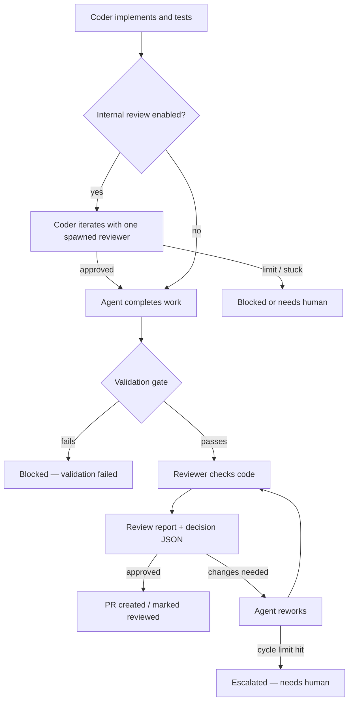
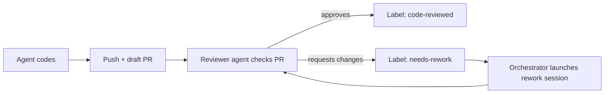
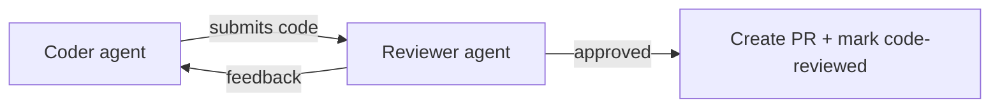
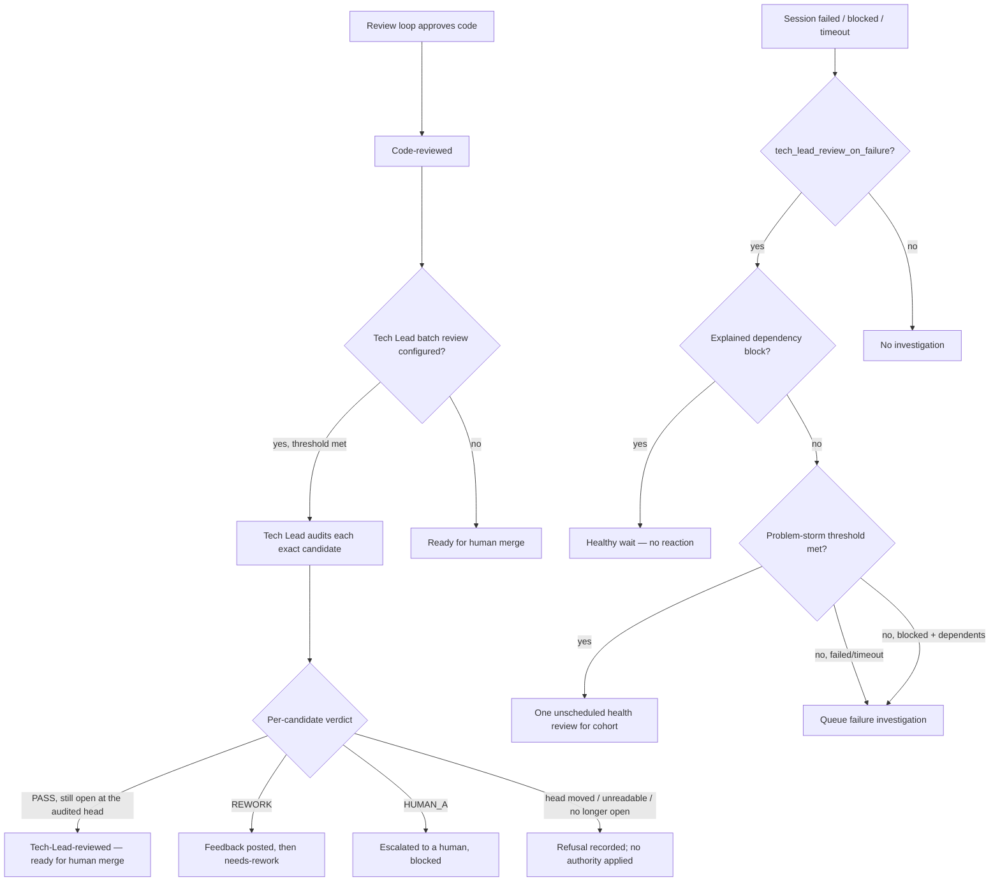
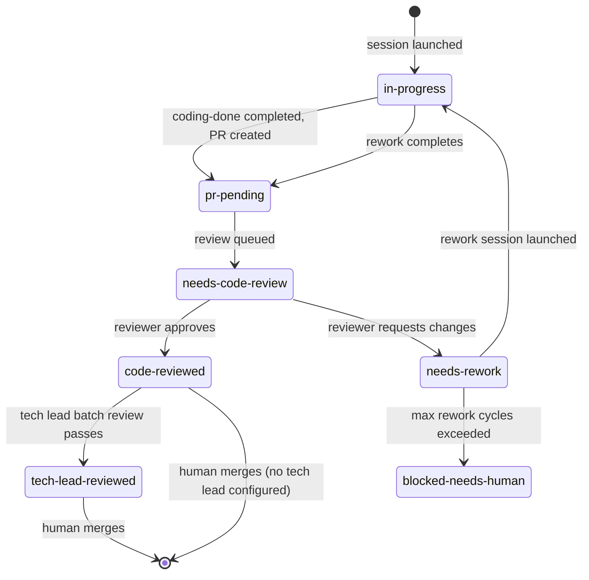

# Review Workflow

## The Review Loop

The core concept: an agent codes, a reviewer checks, and they iterate until the code is approved or the orchestrator escalates. An optional coder-owned internal review loop can run within each coder turn before that independent review.

The independent review flow begins after validation passes. When an agent completes work, the orchestrator processes the completion record — which includes running the validation gate (tests, linting, architecture checks). The optional internal review happens inside the coder turn before that completion; only after completion and validation does the external review loop start.



**Cycle limits prevent infinite loops.** The orchestrator tracks rework iterations (`rework-cycle-N` labels on GitHub). After `max_rework_cycles` (default: 5), it stops the loop and escalates to a human. For in-process exchange modes, `max_rounds` and `max_no_progress` provide additional stopping conditions — if the reviewer reports no progress for consecutive rounds, the loop stops early.

### Internal Review Within a Coder Turn

When `review.internal.enabled` is true, the orchestrator appends the configured
coder-facing instructions to every coder prompt: initial coding, validation
retry, draft-PR rework, and the coder side of an in-process review exchange.
The coder spawns exactly one lightweight internal reviewer and iterates with the
same reviewer until it returns `APPROVED`. A successful coder completion is not
allowed before that approval; an unavailable reviewer, unresolved finding, or
exhausted `max_rounds` requires a blocked or needs-human result.

This is intentionally a prompt-level, high-speed loop. It creates no review
artifacts, labels, completion protocol, or orchestrator-managed round state.
The ordinary external reviewer remains independent and receives the improved
implementation through the unchanged outer workflow.

## Exchange Mechanisms

The review loop can run through different mechanisms. The orchestrator selects the mechanism based on `review.exchange.mode` configuration.

### via-draft-pr

Traditional GitHub-based flow. The orchestrator creates a draft PR, launches a reviewer agent against it, and uses GitHub labels to drive the loop. No human intervention required — the orchestrator detects label changes and launches rework sessions automatically.



### via-local-loop (default)

Coder and reviewer agents alternate within the orchestrator process. Faster iteration — no GitHub round-trips. The orchestrator runs both agents sequentially and passes results between them.



Stops when: reviewer approves, `max_rounds` reached, `max_no_progress` consecutive rounds without improvement, or — for a caller that owns no coder — the first round that asks for changes.

### Who reworks when the reviewer asks for changes

The exchange runs for two kinds of caller, and they mean different things by a
changes-requested round, so the caller states which it is
(`ReviewExchangeRework`, passed to the review-exchange runner):

| Caller | Policy | A changes-requested round |
|--------|--------|---------------------------|
| Any completion with a live session behind it — ordinary sessions, publish retry, tech lead | `IN_EXCHANGE` (the default) | goes back to the exchange's own coder for another bounded round |
| The control continuation (#149) | `HAND_OFF` | ends the exchange at `stopped` / `reviewer_requested_changes`, binding `changes_requested` to the commit that was presented |

The continuation owns no coder: it replays a recorded intent for one exact
candidate `A` whose session is gone, while a control operation still holds the
issue against ordinary work. A coder round there would move the branch to `A'`
inside that hold — the ordering #149 settled, run backwards. The handoff exists
so the rejection becomes durable evidence about exactly `A` and the candidate
goes back to ordinary rework instead.

`max_rounds` is not a substitute: a bound of 1 still runs round 1's coder turn,
which is precisely the turn that must not happen.

The hand-off only pays off if the rejection is read back, and that reading has
one seam. The exchange allocates a run of its own — a *sibling* of the session
run, not a directory beneath it — and writes `review-verdict.json` there. So
the completion pipeline reports which run it allocated
(`ProcessingResult.review_exchange_run`), and the continuation asks
`ReviewVerdictBindings.for_exchange_run` about that run. Deriving the location
from anything else reads an empty directory and drops every verdict, approvals
included; the continuation then settles nothing and pays a second full reviewer
exchange over the same rejected commit before its run allowance runs out.

That reading is also what permits the continuation to settle at all (#178).
`control/continuation_review_evidence.py` owns the promotion and answers one
question — *may this run settle?* A completion that **completed a review
exchange** settles only on a promoted exact-`A` binding; missing, unparseable
and `A'`-bound bindings all withhold the settlement, leaving the recorded
intent undischarged and the operation re-enterable. A completion that ran no
exchange — and reports so, via `review_exchange_completed`, rather than merely
naming no run — is unchanged: it never held review evidence, so it settles from
what it produced.

## Review Artifacts

Before PR creation, each review exchange produces a paired artifact set:

- `review-report.md`: human-readable review with blocker and nit IDs. The coder's next rework prompt receives this full markdown report.
- `review-decision.json`: strict machine-readable decision. This is the authoritative routing/audit contract the orchestrator consumes.

Both artifacts describe the same review item IDs. The markdown is the review content source for operators, PR comments, and coder rework. The JSON drives orchestration with verdict/risk/policy, report pointer and hash, and stable item IDs; it does not need to duplicate report rationale or suggested-change prose. Dashboard and E2E issue detail surfaces show the report as the primary review artifact action and keep the JSON available as a secondary/menu action.

The decision JSON also carries an `abstraction_review` object. Reviewers must use it to say whether the change uses the right owner/port/command abstraction. If a bounded abstraction should be added in the same PR, reviewers set `abstraction_review.status` to `changes_requested` and include `A1`, `A2`, ... findings. An approved decision cannot carry required abstraction changes. If abstraction work is explicitly deferred, the reviewer must set `status` to `deferred` and include `follow_up_issue_url`.

### review-verdict.json — the exact-SHA verdict binding

`review-report.md` and `review-decision.json` are reviewer-authored. Alongside
them the orchestrator writes its own record, `review-verdict.json`, in the
review-exchange directory:

```json
{
  "schema_version": 1,
  "verdict": "approved",
  "reviewed_sha": "<40-hex commit>",
  "decided_at": "2026-08-12T00:00:00+00:00",
  "completed_rounds": 1
}
```

It exists so a verdict is never separable from the commit it was rendered
against — the property Foundation admission depends on
(`docs/foundation/VALIDATED_WORK_DISPOSITION.md` §4, `review.reviewed_sha`).
Four things make it authority rather than convenience:

- **Neither half is agent-supplied.** `verdict` is the orchestrator's own
  conclusion, derived once per reviewer turn from every policy input at once:
  reviewer intent, validation freshness, the approval gate, nit policy, and
  whether the reviewer's decision JSON is an approval at all. A reviewer that
  sends `response_type: ok` while its decision says `changes_requested` (they
  are separate fields, and the transport does not make them agree) is routed
  to rework and binds `changes_requested` — authority follows the decision,
  never the transport field.
- **`reviewed_sha` is what the reviewer was actually given.** It is the commit
  the orchestrator checked out into the reviewer's worktree for that round,
  reported by the checkout itself. It is deliberately not a later reading of
  the coder worktree: the coder's branch can advance between the checkout and
  the read, which would name a commit no reviewer ever opened.
- **The pairing is structural.** A payload naming one half without the other
  does not parse.
- **Validity is re-derived, never remembered.** `BoundReviewVerdict.approves(head_sha)`
  answers False once HEAD moves; the binding is then detectably stale.

Only the terminals a *reviewer round* decides produce a binding: the
`reviewer_ok` completion, which binds `approved`; the no-progress stop, which
binds `changes_requested`; and the `reviewer_requested_changes` handoff, which
also binds `changes_requested`. None of them picks that value itself — all
write the verdict the single derivation above produced, which is why a reviewer
whose transport field disagrees with its own decision never reaches the
approving terminal at all. Every other way an exchange can end
— max rounds exceeded, a protocol failure, a timeout — writes no
`review-verdict.json`, because no reviewer verdict describes the commit the
exchange left behind: max rounds is reached after a coder turn that was asked to
move HEAD past the last reviewed commit, and the other terminals end before a
verdict is rendered at all. Absence is therefore not a gap to fill in later; it
means this exchange produced no verdict any gate may admit.

The binding is written next to `summary.json` and reloaded from there, so it
survives an orchestrator restart. If the orchestrator cannot observe the
presented commit, it records **no** binding rather than guessing — an
unbound verdict is one no later gate can admit, and an unusable observation
never changes the outcome of the review it describes.

### Candidate execution identities — who ran, bound to what they ran against

`review-verdict.json` answers "was this commit approved". Foundation admission
(`docs/foundation/VALIDATED_WORK_DISPOSITION.md` §4, I2c) also requires that
**the reviewer execution principal is distinct from the actor's**, so the
orchestrator records the other half at the same moment: both roles' execution
identities, bound to the same presented commit.

```json
{
  "schema_version": 1,
  "candidate_sha": "<40-hex commit>",
  "actor": {
    "role": "actor",
    "principal":  {"agent_label": "agent:backend"},
    "provenance": {"provider": "claude-code", "model": "opus"}
  },
  "reviewer": {
    "role": "reviewer",
    "principal":  {"agent_label": "agent:reviewer"},
    "provenance": {"provider": "codex", "model": "gpt-5"}
  },
  "observed_at": "2026-08-14T00:00:00+00:00"
}
```

- **Principal is authority; provenance is detail (contract rev 4).** I2c
  compares `principal` and nothing else. `provenance` is retained because
  "which execution actually happened" is worth auditing, but comparing it
  fails both ways: fold provider or model into identity and two separately
  configured reviewing principals collapse into one whenever they run the same
  model — the arrangement this fork operates under — while one principal whose
  model changed between runs reads as two. The contract does not name what
  plays the part of a principal; IO's answer is the agent label, and that
  choice lives in `ExecutionPrincipal`.
- **Orchestrator-observed.** Every field is the launcher's own: the label it
  routed the role by, plus the provider and model read off the same
  `launch_config(agent)` derivation the exchange spawns — so an `ai_system`-only
  agent is recorded as the provider it actually launched on, with the model
  that resolution actually passes (`AgentConfig.resolved_model()`). Reading the
  configured agent instead of the launched one would let the record name a
  model no process was given. An agent cannot assert its own identity, and a
  claim carried in agent-authored output is not evidence.
- **`model` is `null` when the orchestrator pinned none.** An agent with an
  explicit non-Claude provider and no `model:` runs on whatever its CLI
  defaults to — the launcher passes no model, so the record states that rather
  than inventing one. Recording only what was actually passed is what keeps
  the record and the spawn from naming different models. Distinctness is
  unaffected, because no model was ever compared.
- **Bound to the exact candidate.** `candidate_sha` is the commit the
  orchestrator checked out for the reviewer — the same observation
  `reviewed_sha` comes from, so the two records cannot describe different
  commits. A session-start HEAD is deliberately not accepted: it is what the
  worktree held before the actor committed anything.
- **Durable past the worktree.** Unlike the exchange directory, this record
  lives on the attempt record keyed by `(issue, commit)`, under
  `<repo_root>/.issue-orchestrator/attempts` — the primary checkout. Admission
  reads the identity evidence after the sessions that produced it and their
  worktrees are gone. The same record *references* §4's other halves via
  `validation_record_path` — but that path points inside the session directory
  that produced it, which dies with the worktree, so this record does not by
  itself answer §4 after cleanup. How the whole admitted evidence set survives
  cleanup is a separate decision and a prerequisite for #33.
- **Distinctness is falsifiable in both directions.** The comparison excludes
  `role` on purpose: including it would make every pair distinct by
  construction. Excluding provenance is what makes the other direction
  breakable. §11's three rows: one principal in both roles is refused; one
  principal is still one principal however far its provenance differs; two
  principals stay distinct on identical provider/model configuration.

Both reviewer-decided terminals record it, for the same reason both bind a
verdict — who executed the candidate is true whatever the verdict was. An
unobservable presented commit records nothing rather than guessing, and never
changes the outcome of the review it describes.

This is evidence only. Nothing here holds, approves or publishes anything.

Nits are classified in the same reviewer pass as blockers. They do not get a separate review pass. When `review.nits.default_policy` or a per-agent override is `address`, an approved review with only nits is converted into normal coder rework before PR creation. `surface` records and shows nits without blocking PR creation. `ignore` keeps them only in the persisted artifacts.

### via-mcp

Coder and reviewer communicate directly via MCP (Model Context Protocol). Same stopping conditions as via-local-loop, but agents exchange messages bidirectionally rather than through the orchestrator.

### auto

Selects `via-mcp` if both agents support it, otherwise falls back to `via-local-loop`.

## Publishing a run that changed no code

`coding-done completed` asks for the same three actions for every ordinary run,
in this order: `push_branch`, `create_pr`, `post_comment`. An ordinary work item
does not have to change code to be finished — a measurement, an audit, a
read-only investigation produces a RESULT and no commit — and for such a run
`create_pr` cannot succeed: the forge refuses to open a pull request for a
branch that adds nothing. The completion was then marked failed and
`post_comment`, third in the tuple and the only action that publishes the
result, never ran.

`control/ordinary_zero_code.py` settles that. When a run reported `COMPLETED`
and the orchestrator can PROVE its branch offers nothing, the two publication
actions are dropped and `post_comment` is kept, so the reviewed RESULT reaches
the issue and the outcome stays `completed`.

Five facts are required, and any one of them missing is a refusal rather than a
benefit of the doubt:

| Fact | Read from | Missing means |
|------|-----------|---------------|
| outcome is `completed` | the completion record | ordinary path |
| publication intent is still present | the plan being executed | nothing to drop |
| `HEAD` is readable | orchestrator-side git | ordinary path |
| tracked dirt enumerates, and is empty | `list_dirty_files("tracked")` | ordinary path |
| the branch adds 0 commits over the PR base | `commits_against_base` | ordinary path |

The settlement runs **last** — after the publish gate, the independent review
exchange and the pre-publish gate have all judged this candidate and passed it.
Nothing is bought by taking this lane: validation receipts, the reviewer verdict
and the candidate execution identities above are recorded exactly as they are
for a code-bearing run, and only the branch write and the pull request the run
never needed are dropped. A halted or changes-requested exchange returns before
the settlement is ever reached, so review cannot be bypassed by having produced
no code.

### What the settlement tells the phases after it

The proof does not stop at the plan. Two phases run after the actions execute,
and both would otherwise decide from weaker evidence, so the settlement is
carried to them on `CompletionSettlement`:

| Reader | Told | Otherwise |
|--------|------|-----------|
| the code-validation gate | this run offers no code candidate | the quick gate runs over a commit the run did not produce, and a failure there relaunches an already-published run as a coder retry against an empty branch |
| `CompletionActionPlanner` | the posted comment is the whole delivery | `in-progress` is released with no `pr-pending` to take it over, and the finished issue is schedulable again on the very next tick |

The first is the same `CodeCandidateSettlement` contract the tech-lead planning
lane produces; this lane is its second producer, not a second rule.

The second is what gives a zero-code success its **terminal disposition**: the
orchestrator closes the issue. An ordinary run's issue is closed by the merge of
the pull request its `Closes #N` body registered; a run with nothing to merge has
no such carrier, so the close is planned from the settlement instead, carrying a
short comment saying why an issue closed with no pull request. Reopening it is
how an operator says the work is not finished.

The close is ordered **before** the `in-progress` release — the opposite of where
the tech-lead terminal close sits, and deliberately so. That one guards a
tracking issue, where a half-applied batch is better left open and re-auditable.
This one guards boundedness: an apply that fails after the release and before the
close would leave an open, unlabelled, finished work item, which is precisely the
state the scheduler cannot tell from work never started.

**Ordering alone is not enough**, because it is not a fail-stop boundary:
`ActionApplier` catches an ordinary close error, reports a failed `ActionResult`,
and applies the rest of the batch. So the close is planned as a
`ResultOnlyCloseIssueAction` and is a member of the **completion gate**
(`control/completion_effect_gate.py`) alongside the tech-lead mandated
`ResetRetryIssueAction`. Gate members apply first, as their own batch, and the
success-only remainder applies only if every one of them commits:

| Close | `in-progress` | Resulting state |
|-------|---------------|-----------------|
| commits | released | closed, finished — today's success |
| fails | **withheld** | open, still claimed, and **blocked** — see below |

A failed gate also makes the completion's *effective* terminal status `FAILED`,
so the observer, history, retry gating and operator surface all agree that the
run did not finish cleanly.

**Withholding the release is not by itself the boundary.** `Scheduler` blocks
`in-progress` only while an *active session* also exists, and this session has
just terminalized — so the label is stale, the planner's ordinary stale cleanup
removes it, and the only thing left holding the issue is the unreleased
session-history claim, which is process-local and whose `failed` status is
deliberately *not* one of `ABANDONED_AFTER_COMPLETION_HISTORY_STATUSES`. A
restart would start again from an open, unlabelled, finished issue.

So a failed gate also plants the shared `needs-human` blocking label with an
explanation, which is what `domain/models.py` already says a `failed` completion
is expected to do: *"plant a BLOCKING label, so the scheduler refuses the issue
whether or not any in-memory gate is retired."* The escalation ends the way every
other `SESSION_LIFECYCLE` block ends — a human clears the label — which is the
same bounded stop the pre-#337 publish failure gave this run.

`control/completion_gate_surfaces.py` is the one place that maps a gate kind to
what the operator is told, and the mapping is **total** over
`CompletionGateKind`: a gate that can withhold a completion's effects but leaves
nothing durable behind is the defect, not a design choice. Each owner declares
only the words (`GateFailureNarrative`), so a failed result-only close is never
reported as a failed Reset & Retry and vice versa.

An apply that *raised* past the runtime-kill boundary is not a gate kind at all —
it is `UnjudgedApply`, the absence of any verdict. It still terminalizes the
completion `FAILED`, and deliberately writes nothing: a second GitHub write
immediately after a reconciliation/claim raise would re-fail and mask the
re-raise.

### The disposition needs two more things than the five facts

The five facts are proven *before* the actions run — they are what shapes them —
so they establish that the run had **nothing but a comment to deliver**, never
that the comment **was** delivered, and never that the *issue* has nothing in
flight. Both gaps close an issue that should not be closed, so both are checked:

| Also required | Why | If missing |
|---------------|-----|------------|
| the comment actually posted | `add_comment` raises on a 5xx, a rate limit, or an over-size body; a record may request `post_comment` and carry no body; a record may not request it at all, leaving an empty plan that trivially "succeeds" | the disposition is withdrawn and the run is reported as `result_undelivered` — a **critical** error, so it takes the bounded publish-failure path (`publish-fail-count-N`, escalating to `needs-human`) rather than relaunching forever |
| no pull request is **observed** for the issue | fact 5 asks what *this run* added over the base, not what is in flight for the issue. A rework worktree that arrives reset to the base satisfies every fact while its PR's commits live only on the remote | the close is refused; the run keeps the ordinary lifecycle |

That second row is a *verdict*, not a missing url. `control/pull_request_observation.py`
returns one of three answers, and only the middle one may close:

| `PullRequestPresence` | Produced by | Terminal close |
|-----------------------|-------------|----------------|
| `OBSERVED_PRESENT` | the branch lookup found a PR, the session's PR read returned one, or the completion processor handed over a PR url | refused |
| `OBSERVED_NONE` | the branch lookup ran and found nothing, and the session references no PR (or the one it references no longer exists) | allowed |
| `UNKNOWN` | `get_pr(session.pr_number)` **raised**, the status is not `COMPLETED`, or the task kind never looks | refused (fail-closed) |

The distinction is load-bearing for exactly the rework shape above: that session
*has* a pull request, so a read that fails is the least safe moment to infer that
it does not. `UNKNOWN` must never arrive as `OBSERVED_NONE`.

`result_undelivered` is deliberately **not** one of the prefixes
`PublishRecoveryService` reads. Those arm a Retry Publish that pushes a branch
and opens a PR, and a zero-code run has no commit to push — offering that retry
would send the operator straight back to the `create_pr` refusal #336 measured.

Only the delivery half of the settlement is withdrawn. A comment that failed to
post does not put commits on the branch, so the code-candidate proof still
holds; withdrawing it too would hand the quick gate back a run with nothing to
validate.

Tech-lead runs are not settled here. Their publication intent is decided at the
pre-action seam by `control/tech_lead_zero_code.py`, which drops `post_comment`
instead of keeping it — tech-lead prompts promise the orchestrator posts no
comment.

## Multi-Stage Review Pipeline

After the review loop approves code, additional stages can run.

### The Tech Lead gate is bound to an exact candidate (#345)

A batch review's merge-facing disposition is authority for **one commit**, not
for a pull-request number:

1. the manifest records each selected PR's observed `head_sha`, the downloader
   materializes the diff for that commit through the repository host's own
   supported GitHub transport (and refuses to file anything under the
   candidate's name when the read failed or the head moved mid-fetch), and the
   orchestrator-owned `TechLeadLaunchAuthority` carries those candidates beside
   the PR numbers;
2. `candidate-evidence.json` is staged beside the manifest with the independent
   Reviewer's exact-SHA verdict and the publication certification for the same
   commit, so the session never has to fetch that context itself. An entry with
   a non-empty `gap` has not established an approval of this commit;
3. `candidate-contracts.json` is staged beside it with the **executable leaf
   contract** each candidate is judged against: the issue the pull request
   implements (read from the branch, the way every PR-to-issue association in
   this orchestrator is read), that issue's current body, and only the
   governing sources the issue itself declares via `Governed-by:` /
   `Governed-by-optional:`. Each source is recorded by number, `updated_at` and
   `body_sha256`, staged under
   `candidate-contracts/pr-<n>-<sha12>/issue-<m>/`. A bounded issue may narrow
   the work below the repository's Spec/TD, so a constraint that exists only in
   the leaf governs the verdict; an entry with a non-empty `gap` has no resolved
   contract;
4. the decision returns one `candidate_verdicts` entry per candidate — `pass`,
   `rework`, or `human_a` — validated against the launch authority, and
   completion re-reads each pull request before applying it: its **lifecycle
   state and its head**. The head alone is not enough, because a pull request
   merges at exactly the commit that was audited, so a head-only re-read
   answers "unchanged" for the one transition after which no merge-facing
   authority may be applied at all.

A merge-facing `pass` rests on **all three** staged prerequisites, recorded on
the launch authority before the session spawns and asked as one question by
`TechLeadLaunchAuthority.unmet_pass_prerequisites`:
`CandidatePassPrerequisite.INDEPENDENT_REVIEW` — which covers the reviewer's
approval of that exact commit *and* that same commit's publication-gate
certification — `CandidatePassPrerequisite.LEAF_CONTRACT`, and
`CandidatePassPrerequisite.CANDIDATE_DIFF` (#359). Any one unmet refuses the
`pass`. None of them gates `rework` or `human_a` — neither of those claims the
candidate is mergeable.

The refusal receipt names which prerequisite was missing **and the reason the
staging owner recorded for it**, carried on the launch authority as
`CandidatePrerequisiteGap`. One prerequisite covers several conditions — no
verdict at all, a verdict about another commit, a rejection, an uncertified
publication — and the receipt is the operator's only instruction for removing a
label nothing here removes for them, so a fixed sentence that guessed would send
them after a fact that is already on file. The long form lives in
`candidate-evidence.json` / `candidate-contracts.json`, which cleanup disposes of
with the tech-lead worktree; the reason travels out of it on the authority
record. Where nothing was recorded (a legacy row) the prerequisite's own sentence
stands alone rather than being filled in.

The fetch/write/digest mechanics are shared with the planning lane's canonical
context (#183) through `control/canonical_source_staging.py`; what differs is
the failure direction. A planning run whose required source cannot be staged
fails the launch closed, because it has one subject. A batch review records the
failure as a gap on the ONE candidate and audits its siblings normally.

`tech-lead-reviewed` therefore means "this exact candidate passed Tech Lead
contract review", never "a session produced a valid artifact over a manifest
containing this number". A moved candidate inherits nothing; the refusal is
recorded on the pull request.

#### A candidate diff is a successful read, or it does not exist (#359)

`CANDIDATE_DIFF` exists because a transport failure once became evidence. The
downloader used to shell out to `gh pr diff`; the repository's direct-`gh`
guard refused the invocation, the refusal text was written into
`pr-<n>-<sha12>-diff.txt`, and `manifest.json` advertised that file as the
candidate's diff. The live Tech Lead independently declined to `pass` on it —
correctly — but nothing in the product would have stopped it.

The seam is now typed end to end:

- `PullRequestTracker.read_pr_diff` returns a `PullRequestDiffRead`: readable
  bytes, or a reason there are none. A transport error, an HTTP error status, a
  non-text body and an empty success all take the second branch. Success is
  decided by the transport outcome, never by inspecting the body — an error
  page containing `diff --git` is still an error page;
- `GitHubAdapter` implements it over the authenticated REST client
  (`Accept: application/vnd.github.v3.diff`). `TechLeadDownloader` holds no
  command runner at all, so there is no subprocess seam left to refuse;
- a diff file is written, and `PRFiles.diff` names it, only when the read
  succeeded **and** the #345 bracket still binds the bytes to the manifest's
  commit. Otherwise nothing is written, the manifest names no file, and the
  entry carries `diff_established: false` with the observed `diff_gap`;
- that gap travels onto the launch authority as a `CandidatePrerequisiteGap`,
  so a `pass` on the candidate is refused with a receipt naming the transport
  failure, long after the run directory is gone.

Failure is per candidate: one unreadable pull request records its own gap and
leaves its siblings' staged evidence and PASS eligibility untouched.

#### A run's staged evidence outlives its worktree (#360)

Everything above is staged inside the run's own worktree, under
`<run_dir>/tech-lead-data`. Supported teardown removes that worktree — a
focused run's scratch checkout is force-removed the moment it completes,
regardless of the cleanup config — so once disposal has run, the manifest, the
staged candidate evidence and contracts, each candidate's materialized diff,
the board snapshot and the decision/report pair no longer exist anywhere. R29
proof #354 lost exactly that set for anchor #358 and could only preserve
paraphrase of it.

`control/tech_lead_evidence_capture.py` copies the staged tree out before that
happens:

- it runs from the completion handoff (`control/session_completion.py`),
  BEFORE completion processing and long before the planner turns the cleanup
  fact into a removal — so a FAILED or TIMED_OUT run, which never reaches the
  decision-artifact seams at all, still has its launch inputs preserved;
- the capture lands in the HOST repository at
  `.issue-orchestrator/tech-lead-evidence/<session_name>/<run_id>/`, keyed by
  the run's own `SessionRunIdentity`, so two runs of one anchor issue — or the
  several sessions a single worktree hosts — never overwrite each other;
- a `capture.json` receipt beside the tree records every file with its size
  and SHA-256, so a later reader can prove the bytes it holds are the bytes the
  run staged;
- **teardown is unchanged.** Nothing is withheld and no worktree is retained;
  the capture reads the worktree and writes outside it;
- **a failed capture says so.** `TechLeadEvidenceCapture` cannot hold no
  artifacts and record no failure at the same time, the receipt is written on
  both paths, the log line is ERROR on the failing one, and
  `tech_lead.evidence_captured` carries `preserved` either way. A capture that
  did not happen is never reported as evidence preserved — and it never fails
  the session that produced it.

The staging directory is agent-writable, which sets two rules the copy does not
bend: symlinked entries are recorded as skipped rather than followed, and a
staged tree above `MAX_CAPTURE_BYTES` is refused outright instead of copied
into the host repository.

A promotion-grade proof should still capture and verify what it needs
explicitly rather than assume this path ran; what this removes is the case
where nothing durable holds the run's evidence at all.

#### Leaving the watch set

The set that trips the batch threshold has to be the set a review settles, or
the same batch re-fires over the same evidence forever. One owner —
`control/tech_lead_candidate_policy.TechLeadCandidatePolicy` — answers both
halves: which watch-labelled PRs are candidates, and what each concluded
candidate's labels become.

| The run concluded | Labels | Still a candidate? | How it gets back in |
|---|---|---|---|
| `pass`, head unmoved, all three staged prerequisites established | `+tech-lead-reviewed` | no (terminal) | n/a — it passed |
| `rework` | `-` watch label, `-` review-approval label, `+needs-rework` | no | automatically, on the next review that approves it |
| `human_a` | `+tech-lead-failed`, `+needs-human` | no | operator removes `tech-lead-failed` |
| `pass` refused — a staged prerequisite (exact-candidate reviewer approval and its publication certification, a resolved leaf contract, or the candidate's own materialized diff) is missing; the receipt names which and the reason recorded for it | `+tech-lead-failed` | no | operator removes `tech-lead-failed` |
| head moved, unreadable, or never observed | none | **yes, deliberately** | it never left — re-audited at whatever it then proposes |
| the pull request merged or closed after the manifest bound it — whatever its head | none | yes, but unreachable | it never re-enters: the batch observes open pull requests only |

Each row's last column is owned by `CandidateWatchExit.readmission` and is
repeated verbatim in the receipt on the pull request, so the two cannot drift.

The watch label is always `Config.tech_lead_watch_label`, the single owner the
threshold trigger and the manifest builder already share. `tech-lead-failed`
here carries the same meaning it does for a dead session: *this run produced no
Tech Lead authority for this pull request*. Deferred worktree/session cleanup
waits on either terminal label, not on `tech-lead-reviewed` alone.

Membership is bounded by pull-request lifecycle as well as by labels: only
**currently open** pull requests are candidates. Nothing takes the watch label
off on merge, so a repository's merged history keeps it forever — a batch that
counted that history tripped its threshold on pull requests that can never
merge again. The same owner narrows the query *and* re-checks what comes back,
which is also what settles the race: a candidate that merges between the
threshold count and manifest construction is simply absent from the batch, so
it is never audited and receives no disposition. The later observation wins;
openness observed at threshold time is not carried forward. A configured
`review.tech_lead_review_label` still narrows which *open* pull requests are
candidates, but it is not what keeps closed history out.

The same bound holds at the *third* read, completion, where each verdict is
applied — and it is asked there through the same owner
(`TechLeadCandidatePolicy.is_open`) rather than derived again. A batch review
runs for as long as it runs, so a candidate can merge while it is being
audited, at the very commit that was audited. Its standing is then `terminal`
rather than `current`: the pull request receives a refusal receipt and nothing
else — no merge-facing label, no `needs-rework` admission, no `needs-human`
escalation, and no watch-set or terminal label written onto what is now
history. The three reads — threshold, manifest, completion — therefore spell
"may this pull request bear Tech Lead authority" exactly once between them.

Because omitting a candidate would leave it counting toward the threshold, a
decision that renders no verdict for a bound manifest candidate is a contract
violation and rejects the whole decision — the same severity as a verdict about
a pull request the run never audited.

#### Precondition: `pass` needs a candidate-bound reviewer verdict

A `pass` only projects `tech-lead-reviewed` when the orchestrator itself
established that an independent reviewer approved **that exact commit**. It
files that fact only where it concludes a review against a candidate it
observed — the review exchange (`review.exchange.mode` of `auto`, `via-mcp`, or
`via-local-loop`, with a reviewer configured for the coder agent).

The classic lane does not: a standalone review session ending in
`reviewer-done approved` produces the `code-reviewed` label, which is evidence
about the pull request rather than about a commit. In a deployment whose
reviews take that lane — `review.exchange.mode: via-draft-pr`, or an agent with
no reviewer — **every batch `pass` is refused** and `tech-lead-reviewed` is
unreachable. `doctor` reports this as a `Tech Lead Merge Authority` warning at
startup rather than leaving it to be inferred from refusal receipts.

The same applies transitionally to pull requests already open when exact-
candidate binding was introduced: their attempts carry no recorded verdict, so
the first batch after upgrade refuses their `pass` and marks them
`tech-lead-failed` with a receipt explaining why.

**`tech-lead-failed` is a one-way door.** Nothing in the orchestrator removes
it — its only readers are the candidate predicate and the deferred-cleanup gate
— so a pull request carrying it stays out of batch review, and out of any merge
queue gated on `tech-lead-reviewed`, until **an operator removes the label by
hand**. That has always been true of the whole-session failure projection; what
is new is that individual candidates now reach it, through `human_a` and
through a refused `pass`. Each such pull request gets a receipt naming the
label and this manual step, so the state is discoverable from the pull request
rather than from this page.

At rollout, that means the first batch after upgrade will mark every open
code-reviewed pull request `tech-lead-failed`. To re-admit one: get a review
that files a candidate-bound verdict for its current head (i.e. a review through
the exchange), then remove `tech-lead-failed`. Removing the label before such a
verdict exists only produces the same refusal on the next batch.

The rework exit is the opposite kind of door and needs no operator: it clears
the watch label, and the next review that approves the pull request puts it back
in the batch set.



## Requesting a Tech-Lead Run from the Dashboard

Every tech-lead run — whether a timer, a failure, a problem storm, the one-shot
CLI, or an operator's click started it — is admitted by one control-layer owner,
`TechLeadRunCoordinator`. It models each run's **scope** explicitly:

| Scope | Requested from | Concurrency |
|---|---|---|
| Global health review (whole board) | Dashboard actions menu → **Run board health review** | Exclusive: no other tech-lead run executes alongside it |
| Issue investigation (one blocked focus issue) | A blocked card's actions menu and the issue detail drawer → **Investigate with tech lead**; `issue-orchestrator tech_lead <issue#>` | Up to `tech_lead.max_concurrent`, one run per issue |
| Planning investigation (one open, non-blocked issue) | `POST /api/tech-lead/runs` with `"flavor": "planning_investigation"`; `issue-orchestrator tech_lead <issue#> --flavor planning_investigation` | Same as above; a distinct `planning:<n>` run from an investigation of the same issue |

A queued global run acts as a **barrier**: targeted work queued behind it waits
until it completes, and the global run itself waits for active tech-lead
sessions to drain. `worker_budget.tech_lead_slot_availability` still owns the
numeric capacity; the coordinator owns only the semantic conflicts, so the two
cannot drift.

Both dashboard actions POST one discriminated command to `/api/tech-lead/runs`:

```json
{"scope": {"kind": "issue", "issue_number": 42}}
{"scope": {"kind": "issue", "issue_number": 42, "flavor": "planning_investigation"}}
{"scope": {"kind": "global_health_review"}}
```

`flavor` names WHICH focused role an issue-scoped request wants. It is optional
and defaults to `failure_investigation`, so a request that omits it is exactly
the request it was before the field existed. The two focused roles admit
**opposite** subject states — an investigation requires a blocked subject, a
planning run requires an open, non-blocked one — and they are separate
identities (`issue:42` vs `planning:42`) that never coalesce onto each other.

**Every planning run is operator-initiated.** No timer, label route, or
scheduler path can produce one; the only producers are this endpoint and the
`tech_lead` CLI. That is deliberate until a real pilot has established how the
role behaves.

The response is a typed admission outcome — `queued`, `already_queued`,
`already_running`, `paused`, `not_configured`, `not_eligible`, `claim_conflict`,
or `failed` — with a machine-readable `reason` and human `detail` the dashboard
surfaces as a durable toast. A blocked subject requested as a planning run is
refused with `issue_blocked`; an unblocked subject requested as an investigation
is refused with `no_longer_blocked`. Repeated clicks coalesce onto one logical
run (`run_key`), and an issue-scoped request is revalidated against GitHub right
before it is queued, so a closed or ineligible target is refused rather than
launched.

A planning run stages its subject's declared canonical context before the agent
starts — see [`Governed-by:` in the FAQ](../user/faq.md) (Q26) for the syntax an
issue author writes.

Admission only ENQUEUES. The planner still launches, so a hand-aimed run gets
byte-for-byte the same evidence map, launch authority, and sandboxing an
automatic one does — and the dashboard never invokes the one-shot
`orchestrator health-review` CLI, which would take the repository lock and pause
planning under the running engine.

### Launch-time revalidation

Admission is not a standing licence to launch. A queued investigation can wait
many ticks — behind the global barrier, behind capacity, behind an open provider
circuit — and in that window a human can close or unblock its subject. So every
tick the planner re-asks the same eligibility rule against the board it already
fetched, and **withdraws** (not merely holds) any investigation whose subject is
closed or no longer blocked, emitting `tech_lead.run_withdrawn` with the reason.
Withdrawal removes the queue entry, because that entry is an investigation's only
durable record: leaving it would strand the run and keep the dashboard's
"Tech lead queued" affordance lit on an issue with nothing left to investigate.

Only positive evidence withdraws a run. The board is filtered by agent label,
milestone, and `filtering.exclude_labels` — which `tech_lead.inherit_labels`
deliberately re-admits for tech-lead work — so a subject that is merely *absent*
from the board proves nothing and its run is kept. Global runs are exempt: a
health-review anchor is not a blocked work item, and blocked-label eligibility
says nothing about whether the board is still worth auditing.

## Label State Transitions

Labels are the source of truth for issue state. The orchestrator recovers from crashes by reading labels — no database required.



### When a merge leaves the issue open

`pr-pending` gates the issue out of ordinary selection, so it must always have
an owner that can remove it. A merge normally closes the issue and the
awaiting-merge reconciler terminalizes the card. Two other outcomes exist, and
GitHub's **registered closing linkage** (`closingIssuesReferences` — GitHub's
own resolution of the closing keywords, which the orchestrator reads rather
than parsing itself) is what tells them apart:

| Registered linkage | Meaning | Orchestrator | Labels it may clear |
|---|---|---|---|
| Names this issue | Auto-close should have fired but did not | Close-on-merge fallback closes the issue | The full recovered-workflow set |
| Names other issues, not this one | Deliberate non-closing merge (`Refs #N`) | Issue stays open and rejoins selection | **Only `pr-pending`** |
| Registers nothing, PR is orchestrator-authored | Closing keyword defeated — the body always says `Closes #N` | Close-on-merge fallback closes the issue | The full recovered-workflow set |
| Registers nothing, PR is hand-authored | Deliberate non-closing merge | Issue stays open and rejoins selection | **Only `pr-pending`** |
| Unreadable (linkage or PR body) | Unknown | Fails closed — no close, no shed; retried next pass | None |

Those middle rows matter because `merged + issue open` looks identical in every
one of them on every other field. An empty registration is the ambiguous shape:
it means either "the author never asked for a close" or "the author asked in a
form GitHub failed to parse". Authorship settles it — every orchestrator PR body
is written by `build_pr_body`, which opens with `Closes #<issue>` and signs off
with the `Generated by issue-orchestrator` marker, so on a marked PR an empty
registration can only be a defeated keyword. Neither an unreadable linkage nor
an unreadable PR body is ever treated as an answer: that would shed a
queue-gating label, or skip a close, on a guess.

The close is still subject to its pre-existing guard in every row that reaches
it: it needs the PR's `merged_at`, and no close event on the issue at or after
it. An issue that was auto-closed and then deliberately reopened is never
re-closed.

The last column is a separate rule, and it is deliberately narrow. When the
issue's work has landed, the whole recovered-workflow set (`pr-pending`,
`publish-failed`, `publish-fail-count-N`, blocking labels) is stale by
definition. A **continuation merge is not that case**: the issue is
intentionally still open, so the merge establishes only that `pr-pending` is
stale and says nothing about a `blocked:*` reason or a publish failure the
issue was already carrying. Those survive and keep gating selection, so the
issue rejoins the queue exactly as far as its remaining state allows — no
further.

## Configuration

```yaml
review:
  enabled: true
  default: "agent:reviewer"            # Default reviewer agent

  # Coder-owned loop inside every coder turn (independent review still follows)
  internal:
    enabled: false
    max_rounds: 5                      # Reviewer verdicts before coder blocks
    instructions: ".io/internal-review.md" # Relative to the configured repository root

  # Exchange mechanism
  exchange:
    mode: "via-local-loop"             # via-local-loop, via-draft-pr, via-mcp, auto
    loop:
      max_rounds: 10                   # Max iterations (local-loop / mcp)
      max_no_progress: 2              # Stop if reviewer reports no progress N times
      require_validation: true         # Reviewer must confirm validation passed

  # Rework cycle limit (via-draft-pr mode)
  max_rework_cycles: 5                # Escalate to needs-human after N cycles

  nits:
    default_policy: "surface"         # ignore, surface, address
    by_agent: {}                      # e.g. agent:frontend: address

  # Tech Lead batch review
  tech_lead_review_agent: "agent:tech-lead"
  tech_lead_review_threshold: 5           # Trigger after N code-reviewed PRs
  tech_lead_review_on_failure: true       # React to failed/timed-out/unexplained blocked sessions

tech_lead:
  enabled: true                         # One master switch for all new tech-lead work
  health_review:
    interval_minutes: 240              # Periodic floor; 0 disables interval
    storm_threshold: 3                 # K recent problems -> one health review; 0 disables
    storm_window_minutes: 5            # Settle window for the problem cohort
```

Set only `tech_lead.enabled: false` to stop all new batch reviews, failure
investigations, periodic/storm health reviews, stuck sweeps, manual runs,
proposal reconciliation, and finding promotion. The detailed settings remain
configured for a one-line re-enable. Already-running sessions may finish. For
backward compatibility, omitting the key retains the historical behavior:
configuring `review.tech_lead_review_agent` enables the workflow.

## Key Design Decisions

1. **Orchestrator manages workflow** - Agents are workers with simple jobs. Orchestrator triggers the right agent at the right time.

2. **Two trigger modes**:
   - **Immediate (in-memory)**: Work agent completes -> orchestrator queues code review
   - **Recovery (label-based)**: On startup, scans for PRs with `needs-code-review` label

3. **Labels as source of truth** - Crash-safe: labels persist, orchestrator picks up where it left off

4. **A trigger is not authority** - `needs-code-review` says a review was once
   wanted; it does not say this candidate earned one. Validation precedes
   review, so the publication gate's verdict is recorded on the *issue* as
   `validation-failed` and read back by every path that could start a review —
   scan-time discovery, startup recovery, and launch-time revalidation. A
   candidate whose gate failed is not reviewed even though the PR still carries
   the label an earlier candidate left there. The next candidate that clears
   every publication precondition clears the verdict with it, so ordinary work
   needs no human step to get its review back.

   A refusal whose label write does not commit is still a refusal. Recording
   it and enforcing it are two obligations: the gate failure is still reported
   through the completion result and the issue comment, *and* the refusal is
   held in the orchestrator's shared record of unrecorded refusals, which the
   same three paths read alongside the label. Without that, one failed label
   write left a rejected candidate fully review-eligible.

   That record is durable. It latches into the orchestrator-owned ledger in
   `.issue-orchestrator/state/pending_work_claims.sqlite` and rebuilds itself
   from it at startup, so a refusal the gate could not record remotely keeps
   withholding review across a restart rather than dying with the process.
   The latch is strictly negative: it only ever *adds* a refusal, never grants
   one, and it is not a second source of truth — the label remains the primary
   record, and the next candidate that clears the gate releases the latch with
   it.

5. **Authority binds to the candidate, not the issue** - Everything above is
   *negative*: it names reasons a review may not proceed, so a review still
   passes by the absence of a refusal. That is not enough, because the refusal
   is recorded on the issue and the issue outlives the candidate it was about:
   clearing it for a later candidate clears it for every reader, and the review
   trigger an earlier candidate left on the PR is then read as authority for
   whatever commit is at the head now.

   So admission also requires a *positive* fact about one commit: the
   publication gate's own verdict receipt, filed on `Attempt(issue, A)` and
   read back at scan time, at startup recovery, and again at launch. A review
   is admitted only when the PR's **current** head has a receipt that says the
   publish contract passed for that exact SHA. Absence refuses — a candidate no
   gate ever reported on has not cleared one — and so does a failure, a
   timeout, a receipt from the quick contract, and a receipt for a different
   commit. Because the launcher re-reads the PR, a head that moves from A to A′
   while a review sits in the queue is judged as A′: queue history authorizes
   nothing.

   The attempt keeps an ordered, append-only history of every completed
   evaluation rather than one slot, so admission consumes the **latest**
   publication evaluation. A bounded same-SHA revalidation appends its result
   beside the failure it re-ran without rewriting or dropping it — see
   [Validation](../architecture/validation.md) for the bounds on that route.

   Freshness is checked against the contract that is required *now*. A run
   freezes its validation profile's **name**; the contract behind that name is
   re-resolved live, so a receipt is stale if the profile's command has since
   changed, and fails closed if the profile no longer exists. A candidate
   validated under `P1` stays judged against `P1` — moving the default profile
   does not invalidate it.

   Ordinary successful work gains no step: the publication gate files the
   receipt itself, so a candidate that genuinely passed already carries its own
   authority. That holds because the *published* commit is always the certified
   one. A non-fast-forward push retry rebases, which rewrites the branch, so
   before it pushes the rewritten HEAD it puts it through the same publish
   contract — the commit that reaches the remote is the commit the gate
   judged, and it carries its own receipt. A rebased commit the contract
   rejects is not published at all; the completion fails as any other gate
   refusal does, with the `validation-failed` marker and a comment saying why.

   The one repository shape exempt from the requirement is one that configures
   no `validation.publish.cmd` in any profile: there is no publication
   contract, the gate allows publication without running anything, and
   demanding evidence of a gate that cannot exist would block every review
   forever. The negative rules still apply there.

   Exemption is a property of the repository, because a PR does not say which
   validation profile produced it. So the mixed shape — one profile defining
   `validation.publish.cmd` while the profile a candidate actually ran under
   defines none — is refused at publication rather than left to admission: the
   gate holds both facts, and a candidate it let through could never carry the
   receipt admission would then demand. The refusal names the profile to
   configure. Profiles that never publish a change for review (a reviewer's or
   tech lead's, say) are unaffected: the publish contract only applies to a
   completion that offers its work as a change.

## Review Decision Policy (Strict)

Review decision criteria are maintained in `.claude/skills/review-workflow/SKILL.md` (canonical source).
Use that section for nit vs non-nit examples and strict approve/request-changes rules.

## Orchestrator Methods

| Method | Purpose |
|--------|---------|
| `queue_code_review()` | Queue PR for review (called on work completion) |
| `launch_review_session()` | Launch review agent for a PR |
| `process_pending_reviews()` | Process queued reviews (each loop) |
| `scan_needs_rework_prs()` | Scan for PRs needing rework |
| `launch_rework_session()` | Launch work agent to fix issues |
| `check_tech_lead_review_trigger()` | Check if tech lead should trigger |

## Cleanup Configuration

Control when AI session tabs close and worktrees are removed:

```yaml
cleanup:
  with_tech_lead:                    # When tech lead review is enabled
    close_ai_session_tabs: true   # Close tabs after tech lead review
    remove_worktrees: true        # Remove owned worktrees after tech lead review

  without_tech_lead:                 # When tech lead review is NOT enabled
    wait_for_code_review: true    # true = after code review, false = on completion
    close_ai_session_tabs: true
    remove_worktrees: true
```

Worktree removal defaults to `true` for new and omitted configurations. It
still waits for the applicable review gate. Set it to `false` to retain issue
worktrees for inspection. Cleanup timing and actions are independent: if either
`close_ai_session_tabs` or `remove_worktrees` is enabled, the selected actions
wait for the applicable review gate. For example, setting tab closure to
`false` and worktree removal to `true` leaves the tab open and removes the
checkout only after review. Without tech-lead review,
`wait_for_code_review: false` instead runs the selected actions on completion.
If both action flags are `false`, an ordinary successful completion does not
enter the cleanup lifecycle. Failure/timeout/block teardown and disposable
scratch-worktree removal remain immediate lifecycle boundaries.

Review-gated cleanup removes only the checkout and preserves its local branch,
including local-only commits. Branch deletion is reserved for explicitly
disposable scratch/reset lifecycle owners. On startup, the orchestrator also
reconciles proven inactive reviewer and tech-lead scratch worktrees. Manual,
active, activity-unknown, initializing-engine, ambiguous, and reviewer
worktrees whose detached HEAD differs from the exact tip recorded by the
reviewer lifecycle are retained. Reviewer worktrees created before that tip
marker existed use the stricter legacy proof that HEAD still equals the
registered parent worktree tip.

## UI Phase Detection

Dashboard shows "Coding" or "Reviewing" based on session terminal ID:
- `issue-*` -> "Coding"
- `review-*` -> "Reviewing"
